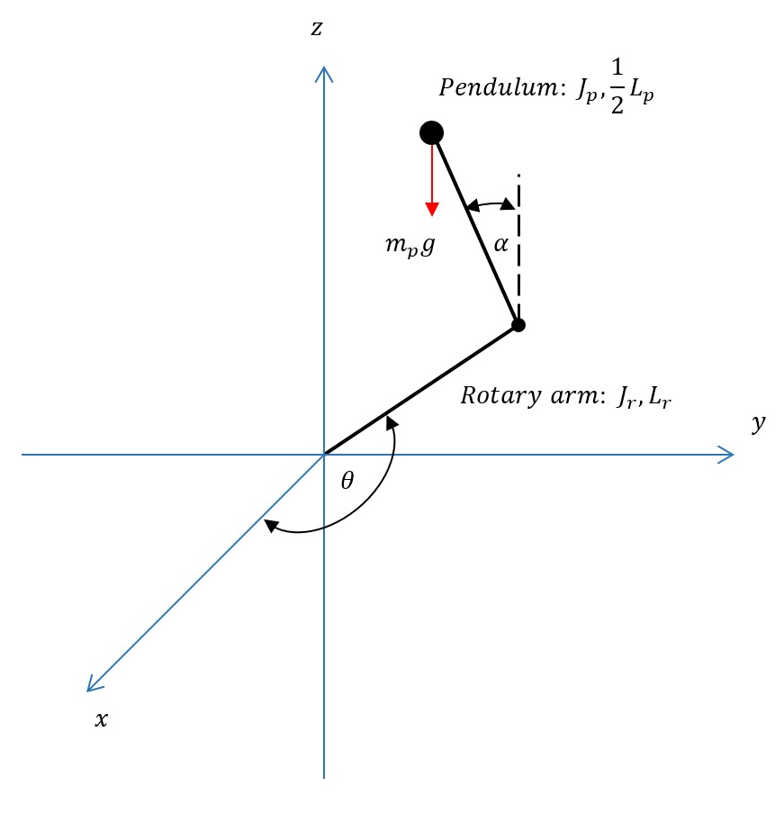

# Furuta Pendulum
#### Claire Christensen, Andrea Cortez, Keith Gramcko, Miguel Gonzalez, Yardley Ordonez, Spring 2020, California State University, Chico
-----------------------------------------------------------------------------------------
#### Table of Contents
- [1.0 Introduction](#1-Introduction)
- [2.0 Modeling](#2-Modeling)
- [3.0 Basic Algorithm](#3-Basic-Algorithm)
- [4.0 Localization](#4-Localization)
  - [4.1. EKF Localization](#41-EKF-Localization)
  - [4.2. Particle Filter Localization](#42-Particle-Filter-Localization)
- [5.0 EKF SLAM](#5-EKF-SLAM)
  - [5.1. EKF SLAM with Known Correspondence](#51-EKF-SLAM-with-Known-Correspondence)
  - [5.2. EKF SLAM with Unknown Correspondence](#52-EKF-SLAM-with-Unknown-Correspondence)
- [6.0 Graph SLAM](#6-Graph-SLAM)
  - [6.1. Graph SLAM with Known Correspondence](#61-Graph-SLAM-with-Known-Correspondence)
- [7.0 Fast SLAM 1](#7-Fast-SLAM-1)
  - [7.1. Fast SLAM 1 with Known Correspondence](#71-Fast-SLAM-1-with-Known-Correspondence)
  - [7.2. Fast SLAM 1 with Unknown Correspondence](#72-Fast-SLAM-1-with-Unknown-Correspondence)
- [8.0 Fast SLAM 2](#8-Fast-SLAM-2)
  - [8.1. Fast SLAM 2 with Unknown Correspondence](#81-Fast-SLAM-2-with-Unknown-Correspondence)
-----------------------------------------------------------------------------------------
# 1. Introduction
1.1 For Control system models dealing with inverted pendulums, one of the most utilized and studied profoundly has been The Furuta Pendulum. This model has been used for experimental analysis for the use of control theory. The Furuta Pendulum was introduced by Katsuhisa Furuta et. al. at Tokyo Institute of Technology. 

The pendulum consists of a rigid horizontal arm connected at one end to a motor. At its distal end is attached an encoder and a freely swinging arm in the vertical plane. The object of the control system is to cause the arm to remain standing. As mentioned before, The Furuta pendulum is of interest in the study of control theory because although it only has two degrees of freedom the related velocity vectors are quadratic due to the rotational nature of the system. This significantly complicates the related control theory.

1.2 This document summarizes the theory, methodology, and calculations required to bring rise to the equations of motion, state-space representation, and subsequently control code via MATLAB and Simulink.

# 2. Modeling

2.1 In order to model the Furuta Pendulum the team followed the provided Rotary Pendulum (ROTPEN) Workbook from Quanser. The following figures and equations are taken directly from the workbook. Necessary derivations are provided as prompted by the workbook in order to bring rise to the linear state-space representation.

2.2 Sketch

  

2.3 Nomenclature

    
-----------------------------------------------------------------------------------------
# 3. Localization
Two filter-based localization algorithms are implemented:
* Parametric model: Extended Kalman Filter based localization
* Non-parametric model: Particle Filter based localization

Localization assumes known landmark locations and correspondences. Thus, both algorithms demonstrate good results.

### 4.1. EKF Localization
Probabilistic Robotics Page 204: **Algorithm EKF_Localization_known_correspondences**.

  

### 4.2. Particle Filter Localization
Probabilistic Robotics Page 252: **Algorithm MCL**.

  

-----------------------------------------------------------------------------------------
## 5. EKF SLAM
EKF SLAM applies EKF to SLAM problem with the following features:
* Feature-based map (landmarks)
* Assume Gaussian noise for motion and measurement models
* Maximum Likelihood data association

### 5.1. EKF SLAM with Known Correspondence
Probabilistic Robotics Page 314: **Algorithm EKF_SLAM_known_correspondences**.

The overall process is not very smooth because of inaccurate odometry data and a lack of information in measurement (each measurement only observes single landmark). But with known correspondences, the algorithm can still converge.

  

### 5.2. EKF SLAM with Unknown Correspondence
Probabilistic Robotics Page 321: **Algorithm EKF_SLAM**.

The algorithm generates very similar estimate at the beginning compared with algorithm 5.1. However, with inaccurate odometry data, data association cannot work as expected and gives bad correspondences at the end, which degrades both landmark and robot state estimates.

  

-----------------------------------------------------------------------------------------
## 6. Graph SLAM
Graph SLAM is the only optimization-based SLAM algorithm implemented in this project. It has the following features:
* Not online SLAM algorithm - require full data when running
* Construct Information Matrix and Information Vector from control and measurement constraints
* Apply factorization to reduce dimensions of Information Matrix and Information Vector
* Solve with least square method

### 6.1. Graph SLAM with Known Correspondence
Probabilistic Robotics Page 350: **Algorithm GraphSLAM_known_correspondences**.

Graph SLAM computes the best estimate for the full SLAM problem. Thus, the global estimate will be influenced by local errors. This is demonstrated in the four plots below.

When running graph SLAM for the short time, it can give highly accurate estimate. But when running on full problem, the trajectory drifts off significantly. This is because the odometry and measurement data are getting less informative towards the end of the period.

  

-----------------------------------------------------------------------------------------
## 7. Fast SLAM 1
Fast SLAM applies Rao-Blackwellized Particle Filter to SLAM problem. It has the following features:
* Factorize SLAM problem into two independent sub-problems: localization and mapping
* Use Particle Filter to estimate robot state (localization)
* Use EKF to estimate each landmark state (mapping)

### 7.1. Fast SLAM 1 with Known Correspondence
Probabilistic Robotics Page 450: **Algorithm FastSLAM 1.0_known_correspondences**.

  

### 7.2. Fast SLAM 1 with Unknown Correspondence
Probabilistic Robotics Page 461: **Algorithm FastSLAM 1.0**.

  

-----------------------------------------------------------------------------------------
## 8. Fast SLAM 2
The main difference between Fast SLAM 2.0 and Fast SLAM 1.0 is that when sampling new pose, Fast SLAM 2.0 incorporates the measurement information. However, this makes implementing the algorithm a lot more difficult.

### 8.1. Fast SLAM 2 with Unknown Correspondence
Probabilistic Robotics Page 463: **Algorithm FastSLAM 2.0**.

  

-----------------------------------------------------------------------------------------
